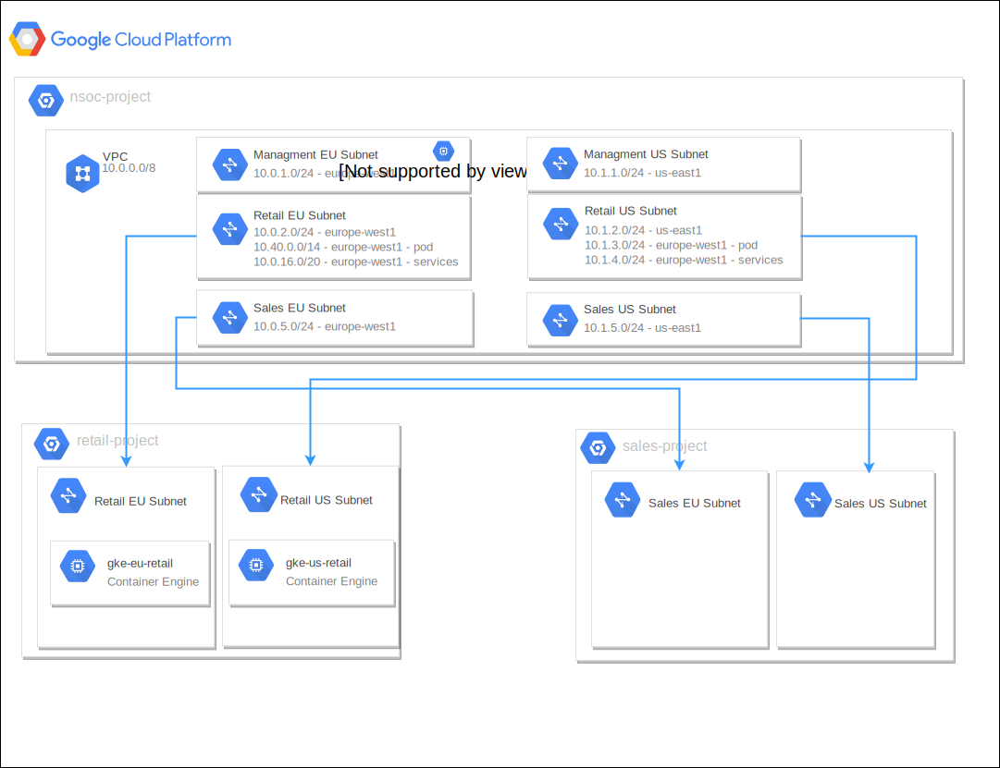

# Use-case deep dive
Deploy a GKE training environment using IP alias and private cluster configuration with [Terraform](https://www.terraform.io/).
Use [kitchen-terraform](https://github.com/newcontext-oss/kitchen-terraform) to verify deployement

*Note* : Kitchen-terraform use [inspec](https://www.inspec.io/) as test provider. You can plug many inspec implementation. In this case we will use [inspec-gcp](https://github.com/inspec/inspec-gcp)

## Landscape


## Terraform files
* main.tf : Create projects and link they together
* network.tf : Create basic network configuration on host project
* ~~nat.tf : Allow internal servers to reach internet~~
* iam.tf : Define IAM permissions
* ~~gke.tf : GKE cluster configuration~~
* variables.tf : Inputs
* README.md : Autogen documentation using [Terraform-docs](https://github.com/segmentio/terraform-docs)

*Note :* nat and gke configuration removed for this lab.

# Deployment
## Requirements
* GCP credentials
* `Shared VPC Admin (compute.xpnAdmin)` role
## Configure credentials
Create a service account or use your own credentials to deploy resources.
```
$ export GOOGLE_APPLICATION_CREDENTIALS=<path-to-json>
or
$ gcloud auth application-default login
```
## Deploy resources
```
$ terraform init
$ terraform plan
$ terraform apply
```

# Unit Tests
[inspec-gcp](https://github.com/inspec/inspec-gcp)

## Init workspace
```
$ inspec init profile unit-test
Create new profile at /home/jnahelou/sfeir/chfeir-share/demo/unit-test
 * Create file README.md
 * Create directory controls
 * Create file controls/example.rb
 * Create file inspec.yml
 * Create directory libraries
 * Create file libraries/.gitkeep
```

Edit `inspec.yml` and add `inspec-gcp` configuration :
```
depends:
- name: git-profile
  ## Using local config
  #path: /home/jnahelou/perso/inspec-gcp
  ## Using git repository
  git: https://github.com/jnahelou/inspec-gcp
  branch: feat/vpn-support
  ## Using tarball
  #- name: inspec-gcp
  #  url: https://github.com/inspec/inspec-gcp/archive/master.tar.gz
supports:
  - platform: gcp
# Configure attributes
attributes:
  - name: gcp_project_id
    type: string
  - name: gcp_project_name
    type: string
```

Get dependencies :
```
$ inspec vendor --overwrite
```

Create attributes file :
```
$ cat project_attributes.yml
gcp_project_id: nsoc-demo-project-wxyz
gcp_project_name: nsoc-demo-project
```

Run tests :
```
$ inspec exec . -t gcp://  --attrs project_attributes.yml
```

Destroy environment :
```
$ terraform destroy
```


# TDD
## Install Kitchen-Terraform
[Official doc](https://github.com/newcontext-oss/kitchen-terraform)

*Note* : `unf_ext` require `ruby2.X-dev` package

## Configure kitchen

**tree overview**
```
├── main.tf
├── README.md
├── terraform.tfstate.d
│   └── kitchen-terraform-default-terraform
│       ├── terraform.tfstate
│       └── terraform.tfstate.backup
├── test
│   ├── fixtures
│   │   └── test_variables.tfvars
│   └── integration
│       └── default
│           ├── controls
│           │   └── projects.rb
│           └── inspec.yml
```


Configure kitchen to :
* deploy platform using terraform
* run *default* test group
* forward basic terraform output to integration tests

**.kitchen.yml**
```
---
driver:
  name: terraform
  variable_files:
    - test/fixtures/test_variables.tfvars

provisioner:
  name: terraform

platforms:
  - name: terraform

verifier:
  name: terraform

suites:
  - name: default
    verifier:
      systems:
         - name: local
           backend: gcp
      groups:
        - name: default
      attrs_outputs:
        project_id: project_id
        project_name: project_name
```

Configure `kitchen` environment to use [inspec-gcp](https://github.com/inspec/inspec-gcp)

**test/integration/default/inspec.yml**
```
name: default
title: GCP InSpec default tests
version: 0.1.0
inspec_version: '>= 2.2.10'
depends:
  - name: inspec-gcp
    url: https://github.com/inspec/inspec-gcp/archive/master.tar.gz
supports:
  - platform: gcp
```


Write tests !


**test/integration/default/controls/projects.rb**
```
gcp_project_id = attribute('project_id', description: 'The GCP project identifier.')
gcp_project_name = attribute('project_name', description: 'The GCP project name.')

control "projects" do
	describe google_project(project: gcp_project_id) do
		it { should exist }
		its('name') { should eq gcp_project_name }
	end
end
```

*Note :* `Terraform` outputs are linked to `InSpec` attributes

## Start integration
```
$ kitchen create
$ kitchen converge
$ kitchen verify
$ kitchen destroy

or

$ kitchen test
```

# References
[Kitchen-terraform rubydoc](https://www.rubydoc.info/gems/kitchen-terraform/Kitchen)
[inspec documentation](https://www.inspec.io/docs/)
[inspec-gcp repo](https://github.com/inspec/inspec-gcp)
